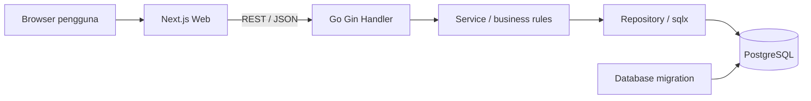

# Reksolindo Equipment Inventory (EquipmentRM)

Aplikasi web inventaris equipment untuk platform **Asset Reliability Management (ARM)** Reksolindo. Aplikasi ini membantu tim mencatat aset industri, melihat kondisi & status inspeksi equipment, memperbarui data, memfilter status, mengurutkan data, serta menghapus data inventaris.

Repository GitHub: **[EquipmentRM](https://github.com/algididntwakeup/EquipmentRM)**

Implementasi mengikuti spesifikasi pada [PRD Equipment Inventory](docs/PRD_Equipment_Inventory_Reksolindo%20%281%29.md), dibangun menggunakan stack **Next.js (App Router)**, **REST API Go (Gin & sqlx)**, **PostgreSQL 15**, dan ter-containerize penuh dengan **Docker Compose** agar reviewer/developer dapat menjalankan seluruh sistem dengan satu perintah.

---

## 🚀 Panduan Clone Repository & Menjalankan Aplikasi

### 1. Cara Clone Repository dari GitHub

Buka terminal (Git Bash, PowerShell, Command Prompt, atau Terminal macOS/Linux) dan jalankan:

```bash
git clone https://github.com/algididntwakeup/EquipmentRM.git
cd EquipmentRM
```

### 2. Panduan Cepat untuk Reviewer / Non-Teknis

Bagian ini adalah cara termudah untuk mencoba aplikasi. Anda **tidak perlu memasang Go, Node.js, atau PostgreSQL** secara terpisah di mesin lokal.

#### A. Yang Perlu Disiapkan

- Laptop / PC dengan OS Windows, macOS, atau Linux.
- Browser modern seperti Chrome, Edge, atau Firefox.
- [Docker Desktop](https://www.docker.com/products/docker-desktop/) yang sudah terpasang dan sedang berjalan.
- Port `3000` (Web), `8080` (API), dan `5433` (PostgreSQL) sebaiknya tidak sedang digunakan aplikasi lain.

Untuk Windows, buka aplikasi Docker Desktop dan pastikan ikonisnya menunjukkan status *Engine running*.

#### B. Menjalankan Seluruh Aplikasi

Pastikan terminal Anda berada di dalam folder `EquipmentRM` yang berisi file `docker-compose.yml`.

Jalankan perintah berikut untuk menyiapkan konfigurasi environment bawaan:

**Windows (PowerShell):**
```powershell
Copy-Item .env.example .env
```

**macOS / Linux:**
```bash
cp .env.example .env
```

Kemudian jalankan seluruh container (Database, API, Web, dan Migrasi Otomatis):

```bash
docker compose up -d --build
```

### 3. Pastikan Docker siap

Jalankan:

```powershell
docker --version
docker compose version
```

Jika kedua perintah menampilkan nomor versi, Docker sudah siap. Jika muncul pesan bahwa perintah tidak dikenali atau Docker daemon tidak berjalan, buka atau restart Docker Desktop terlebih dahulu.

### 4. Buat konfigurasi lokal

Jalankan satu kali:

```powershell
Copy-Item .env.example .env
```

Pengguna macOS/Linux dapat menggunakan:

```bash
cp .env.example .env
```

Nilai bawaan pada `.env.example` memang disiapkan untuk demo lokal. Jangan menggunakan password demo tersebut untuk deployment produksi.

Jika berkas `.env` sudah ada, langkah penyalinan ini dapat dilewati.

### 5. Jalankan seluruh aplikasi

Jalankan:

```powershell
docker compose up -d --build
```

Pada proses pertama, Docker akan mengunduh image dan memasang dependency. Proses ini biasanya memerlukan beberapa menit, tergantung kecepatan internet.

Periksa statusnya dengan:

```powershell
docker compose ps -a
```

Kondisi yang diharapkan:

- `db` berstatus **healthy**.
- `api` berstatus **healthy**.
- `web` berstatus **running/up**.
- `migrate` boleh berstatus **Exited (0)**. Ini normal dan berarti migrasi database berhasil selesai.

### 6. Buka aplikasi

- Web: [http://localhost:3000](http://localhost:3000)
- Daftar equipment: [http://localhost:3000/equipment](http://localhost:3000/equipment)
- Pemeriksaan API: [http://localhost:8080/health](http://localhost:8080/health)

Jika API sehat, alamat `/health` akan menampilkan respons JSON dengan status `success`.

> Jika `WEB_PORT` pada `.env` diubah menjadi `3001`, buka `http://localhost:3001` dan bukan port `3000`.

## Skenario pengujian aplikasi (sekitar 5-10 menit)

Skenario berikut dapat digunakan oleh HR, reviewer, QA, atau pengguna yang belum mengenal source code.

### A. Periksa dashboard

1. Buka halaman utama.
2. Pastikan kartu ringkasan equipment tampil.
3. Jika database masih kosong, jumlah equipment akan bernilai nol. Ini kondisi normal.

### B. Tambahkan equipment

1. Pilih menu **Equipment**.
2. Klik tombol **Tambah Equipment**.
3. Isi contoh data berikut:

| Kolom | Contoh nilai |
| --- | --- |
| Nama equipment | Pompa Sirkulasi A-01 |
| Tipe equipment | Piping |
| Lokasi | Area Produksi 1 |
| Inspeksi terakhir | 2026-07-01 |
| Status | Aktif |

4. Klik **Simpan Equipment**.
5. Pastikan aplikasi membuka halaman detail dan menampilkan data yang baru disimpan.

### C. Uji daftar, filter, dan pencarian halaman

1. Kembali ke daftar equipment.
2. Pastikan equipment tadi muncul.
3. Ketik sebagian nama, tipe, atau lokasi pada kotak **Cari equipment**. Hasil akan berubah otomatis setelah pengguna berhenti mengetik sejenak.
4. Hapus kata pencarian dengan tombol **x** dan pastikan daftar lengkap kembali tampil.
5. Pilih filter status **Aktif** dan pastikan data menyesuaikan.
6. Gunakan pencarian dan filter status bersamaan untuk memastikan keduanya dapat dikombinasikan.
7. Jika jumlah data lebih dari 10, gunakan tombol halaman berikutnya/sebelumnya untuk menguji pagination.
8. Klik judul kolom yang dapat diurutkan untuk mencoba pengurutan data pada halaman aktif.

### D. Ubah equipment

1. Buka detail **Pompa Sirkulasi A-01**.
2. Klik **Edit**.
3. Ubah status menjadi **Dalam Perbaikan**.
4. Simpan perubahan.
5. Pastikan status baru muncul pada halaman detail dan daftar.

### E. Hapus equipment

1. Dari detail atau daftar, pilih aksi **Hapus**.
2. Baca dialog konfirmasi, lalu konfirmasi penghapusan.
3. Pastikan data tidak lagi tampil pada daftar.

### F. Periksa validasi

1. Buka form tambah equipment.
2. Biarkan kolom wajib kosong lalu coba simpan.
3. Pastikan aplikasi menampilkan pesan validasi dan tidak membuat data kosong.
4. Untuk menguji format tanggal yang salah secara langsung ke API, gunakan contoh request invalid pada bagian REST API.

## Menghentikan, melanjutkan, dan mereset aplikasi

Menghentikan container tanpa menghapus data:

```powershell
docker compose down
```

Menjalankannya kembali:

```powershell
docker compose up -d
```

Data PostgreSQL tetap tersimpan karena menggunakan Docker volume.

Jika ingin menghapus **seluruh data demo** dan memulai database dari nol:

```powershell
docker compose down -v
docker compose up -d --build
```

> Peringatan: opsi `-v` menghapus volume database. Data yang sudah dimasukkan tidak dapat dikembalikan.

## Troubleshooting untuk reviewer

### Docker tidak berjalan

Gejala umum: `Cannot connect to the Docker daemon` atau perintah `docker compose` gagal.

Solusi:

1. Buka Docker Desktop.
2. Tunggu sampai engine selesai start.
3. Jalankan kembali `docker compose up -d --build`.

### Port sudah digunakan

Gejala umum: `bind: Only one usage of each socket address` atau `port is already allocated`.

Ubah port pada `.env`, misalnya:

```dotenv
PORT=8081
WEB_PORT=3001
CORS_ALLOWED_ORIGINS=http://localhost:3001
```

Kemudian build ulang:

```powershell
docker compose up -d --build
```

Aplikasi lalu tersedia di `http://localhost:3001` dan API di `http://localhost:8081`.

### Password PostgreSQL ditolak

Gejala umum:

```text
pq: password authentication failed for user "user_reksolindo" (28P01)
```

Penyebab paling umum adalah volume database pernah dibuat memakai password berbeda dari nilai `DB_PASSWORD` pada `.env` saat ini.

Untuk database lokal yang datanya boleh dibuang, cara paling sederhana adalah:

```powershell
docker compose down -v
docker compose up -d --build
```

Jika data harus dipertahankan, samakan password role PostgreSQL dengan `.env`:

```powershell
docker compose exec db psql -U user_reksolindo -d inventory_db -c "ALTER ROLE user_reksolindo WITH PASSWORD 'change_me';"
docker compose restart api
```

Ganti `change_me` pada perintah di atas dengan nilai `DB_PASSWORD` yang benar. Jangan menyalin password produksi ke tangkapan layar atau log publik.

### Halaman web terbuka tetapi data gagal dimuat

1. Buka [http://localhost:8080/health](http://localhost:8080/health).
2. Periksa status service:

```powershell
docker compose ps
docker compose logs api
docker compose logs db
```

3. Jika baru mengubah port atau konfigurasi, jalankan `docker compose up -d --build` lagi.

### Service `migrate` berstatus Exited

`migrate` memang hanya dijalankan sekali untuk menyiapkan tabel, lalu berhenti. Status `Exited (0)` berarti berhasil. Hanya status selain `0` yang menandakan kegagalan.

### Melihat semua log

```powershell
docker compose logs -f
```

Tekan `Ctrl+C` untuk berhenti mengikuti log. Container tetap berjalan karena sebelumnya dijalankan dengan opsi `-d`.

## Ringkasan spesifikasi

| Bagian | Implementasi |
| --- | --- |
| Jenis aplikasi | Web-based asset/equipment inventory |
| Pengguna utama | Tim reliability, maintenance, operasional, QA, dan reviewer |
| Frontend | Next.js 16, React 19, TypeScript, Tailwind CSS 4 |
| Backend | Go 1.26, Gin, sqlx |
| Database | PostgreSQL 15 |
| API | REST/JSON |
| Deployment lokal | Docker Compose |
| Migrasi | golang-migrate |
| Pagination | Server-side, default 10 item per halaman |
| Filter | Status equipment |
| Tanggal | Format `YYYY-MM-DD` |
| Status valid | `Aktif`, `Dalam Perbaikan`, `Non-Aktif` |

### Fitur yang sudah tersedia

- Dashboard dengan ringkasan jumlah equipment berdasarkan data API.
- Daftar equipment dengan live search, pagination, filter status, dan pengurutan pada halaman aktif.
- Tambah, lihat detail, ubah, dan hapus equipment.
- Validasi form di frontend dan validasi request di backend.
- Tampilan loading, data kosong, error jaringan, data tidak ditemukan, dan error validasi.
- Respons API success/error yang konsisten.
- CORS yang dapat dikonfigurasi melalui environment variable.
- Migrasi database otomatis sebelum API dijalankan.
- Unit test untuk service dan handler backend.
- Docker health check untuk database dan API.

### Di luar cakupan versi ini

Sesuai batasan PRD, versi ini belum mencakup:

- Login, autentikasi, dan role-based access control.
- Upload foto atau dokumen equipment.
- Audit trail riwayat perubahan.
- Notifikasi atau pengingat maintenance.
- Modul maintenance work order lengkap.
- Deployment cloud/production dan backup otomatis.

## Arsitektur aplikasi



Backend menggunakan pemisahan tanggung jawab berikut:

- **Handler**: menerima HTTP request, membaca parameter, dan membentuk HTTP response.
- **Service**: menjalankan validasi dan aturan bisnis.
- **Repository**: menjalankan query dan interaksi dengan PostgreSQL.

Alur startup Docker Compose adalah `db -> migrate -> api -> web`. API baru start setelah migrasi selesai, dan web baru start setelah API sehat.

## Model data equipment

| Field | Tipe | Aturan |
| --- | --- | --- |
| `id` | UUID | Dibuat otomatis oleh server |
| `nama_equipment` | string | Wajib, kolom database maksimal 150 karakter |
| `tipe_equipment` | string | Wajib, kolom database maksimal 100 karakter |
| `lokasi` | string | Wajib, kolom database maksimal 150 karakter |
| `tanggal_inspeksi_terakhir` | date | Wajib, format tanggal valid `YYYY-MM-DD` |
| `status` | enum | Wajib; `Aktif`, `Dalam Perbaikan`, atau `Non-Aktif` |
| `created_at` | timestamp | Dibuat otomatis |
| `updated_at` | timestamp | Diperbarui otomatis |

## REST API

Base URL lokal: `http://localhost:8080`

| Method | Endpoint | Fungsi |
| --- | --- | --- |
| `GET` | `/health` | Pemeriksaan kesehatan aplikasi dan database |
| `GET` | `/ping` | Pemeriksaan ringan API |
| `POST` | `/equipment` | Menambahkan equipment |
| `GET` | `/equipment` | Mengambil daftar equipment |
| `GET` | `/equipment/:id` | Mengambil detail equipment |
| `PUT` | `/equipment/:id` | Memperbarui equipment |
| `DELETE` | `/equipment/:id` | Menghapus equipment |

Parameter daftar:

| Parameter | Default | Keterangan |
| --- | --- | --- |
| `page` | `1` | Nomor halaman, minimal 1 |
| `limit` | `10` | Jumlah data per halaman, 1-100 |
| `status` | kosong | Filter salah satu status valid; penulisan harus sama |
| `search` | kosong | Pencarian case-insensitive pada nama, tipe, dan lokasi |

Contoh:

```text
GET /equipment?page=1&limit=10&status=Aktif&search=pompa
```

### Contoh membuat equipment dari PowerShell

```powershell
$body = @{
  nama_equipment = "Pompa Sirkulasi A-01"
  tipe_equipment = "Piping"
  lokasi = "Area Produksi 1"
  tanggal_inspeksi_terakhir = "2026-07-01"
  status = "Aktif"
} | ConvertTo-Json

Invoke-RestMethod `
  -Method Post `
  -Uri "http://localhost:8080/equipment" `
  -ContentType "application/json" `
  -Body $body
```

Contoh respons sukses:

```json
{
  "success": true,
  "data": {
    "id": "5a756acc-31b2-4fd4-bb7e-95aaef4a7736",
    "nama_equipment": "Pompa Sirkulasi A-01",
    "tipe_equipment": "Piping",
    "lokasi": "Area Produksi 1",
    "tanggal_inspeksi_terakhir": "2026-07-01",
    "status": "Aktif",
    "created_at": "2026-07-31T10:00:00Z",
    "updated_at": "2026-07-31T10:00:00Z"
  }
}
```

Contoh respons validasi gagal:

Request berikut sengaja mengosongkan nama dan memakai format tanggal yang salah:

```json
{
  "nama_equipment": "",
  "tipe_equipment": "Piping",
  "lokasi": "Area Produksi 1",
  "tanggal_inspeksi_terakhir": "31-07-2026",
  "status": "Aktif"
}
```

```json
{
  "success": false,
  "error": {
    "code": "VALIDATION_ERROR",
    "message": "Input tidak valid",
    "details": {
      "nama_equipment": "Nama equipment tidak boleh kosong",
      "tanggal_inspeksi_terakhir": "Format tanggal harus YYYY-MM-DD"
    }
  }
}
```

Kode HTTP utama yang digunakan:

- `200 OK`: request berhasil.
- `201 Created`: equipment berhasil dibuat.
- `400 Bad Request`: parameter, JSON, atau data bisnis tidak valid.
- `404 Not Found`: equipment tidak ditemukan.
- `500 Internal Server Error`: kesalahan server/database yang tidak terduga.

## Konfigurasi environment

Konfigurasi Docker utama berada pada `.env` di root proyek.

| Variable | Default demo | Fungsi |
| --- | --- | --- |
| `DB_HOST` | `localhost` | Host database dari mesin lokal |
| `DB_PORT` | `5433` | Port PostgreSQL yang diekspos ke host |
| `DB_USER` | `user_reksolindo` | User PostgreSQL |
| `DB_PASSWORD` | `change_me` | Password demo lokal |
| `DB_NAME` | `inventory_db` | Nama database |
| `DB_SSLMODE` | `disable` | Mode SSL untuk koneksi lokal |
| `PORT` | `8080` | Port REST API di host |
| `WEB_PORT` | `3000` | Port frontend di host |
| `CORS_ALLOWED_ORIGINS` | `http://localhost:3000` | Origin frontend yang diizinkan API |

Jika `WEB_PORT` diubah, `CORS_ALLOWED_ORIGINS` juga harus diubah agar sama dengan alamat frontend. Setelah perubahan port atau API URL, gunakan opsi `--build` agar konfigurasi frontend ikut diperbarui.

## Struktur proyek

```text
takehomet-arm/
|-- backend/
|   |-- cmd/api/                  # Entry point REST API
|   |-- internal/
|   |   |-- handler/              # HTTP handler dan format response
|   |   |-- model/                # Entity, payload, tanggal, pagination
|   |   |-- repository/           # Query PostgreSQL
|   |   `-- service/              # Validasi dan aturan bisnis
|   |-- migrations/               # Migrasi up/down
|   |-- pkg/db/                   # Inisialisasi koneksi PostgreSQL
|   |-- Dockerfile
|   `-- go.mod
|-- frontend/
|   |-- app/                       # Halaman Next.js App Router
|   |-- components/                # Komponen UI bersama
|   |-- lib/                       # REST client dan utility
|   |-- public/                    # Asset statis
|   |-- types/                     # Tipe data equipment frontend
|   |-- Dockerfile
|   `-- package.json
|-- docs/
|   |-- PRD_Equipment_Inventory_Reksolindo (1).md
|   |-- implementation_plan.md
|   `-- walkthrough.md
|-- .env.example
|-- docker-compose.yml
`-- README.md
```

## Menjalankan untuk development tanpa container aplikasi

Bagian ini ditujukan untuk developer. Cara Docker pada bagian awal tetap direkomendasikan untuk reviewer.

### Prasyarat development

- Go 1.26 atau kompatibel.
- Node.js 22 dan npm.
- Docker Desktop untuk PostgreSQL, atau PostgreSQL 15 lokal.

### Jalankan database dan migrasi

Dari root proyek:

```powershell
Copy-Item .env.example .env
docker compose up -d db migrate
```

### Jalankan backend Go

Jika service Docker `api` sedang berjalan, hentikan agar port tidak bentrok:

```powershell
docker compose stop api
```

Kemudian:

```powershell
Set-Location backend
Copy-Item .env.example .env
go mod download
go run cmd/api/main.go
```

Konfigurasi `backend/.env` memakai `DB_PORT=5433` agar terhubung ke PostgreSQL yang diekspos Docker. Pastikan `DB_PASSWORD` sama dengan konfigurasi root `.env` yang digunakan saat volume database pertama kali dibuat.

### Jalankan frontend Next.js

Buka terminal baru:

```powershell
Set-Location frontend
Copy-Item .env.example .env.local
npm install
npm run dev
```

Frontend development tersedia di `http://localhost:3000`. Nilai `NEXT_PUBLIC_API_URL` pada `frontend/.env.local` harus menunjuk ke API yang aktif.

## Verifikasi dan testing

Backend:

```powershell
Set-Location backend
go test ./...
go vet ./...
go build ./...
```

Frontend:

```powershell
Set-Location frontend
npm install
npm run lint
npx tsc --noEmit
npm run build
npm audit --omit=dev
```

Verifikasi Docker Compose:

```powershell
docker compose config --quiet
docker compose up -d --build
docker compose ps -a
```

Pada implementasi saat ini, test backend, vet, build backend, lint frontend, TypeScript check, production build frontend, smoke test route, CORS preflight, dan alur CRUD end-to-end telah dijalankan. Audit dependency produksi frontend tidak menemukan advisory.

## Keputusan desain

- PostgreSQL diekspos pada port host `5433` untuk mengurangi benturan dengan instalasi PostgreSQL lokal yang umumnya memakai `5432`.
- UUID digunakan sebagai ID agar identifier tidak mudah ditebak dan aman untuk distribusi di masa depan.
- Status disimpan sebagai `VARCHAR`, bukan PostgreSQL `ENUM`, sementara daftar nilai valid dijaga oleh service. Ini mempermudah penambahan status baru tanpa migrasi tipe database.
- Validasi diletakkan di service agar aturan bisnis dapat diuji tanpa bergantung pada HTTP atau database.
- Repository memakai query berparameter untuk mencegah SQL injection.
- Format error dibuat konsisten agar frontend dapat menampilkan pesan yang tepat.
- Pagination dan filter dijalankan di server untuk menjaga performa ketika data bertambah.
- Live search menggunakan debounce 350 ms dan pencarian server-side pada nama, tipe, serta lokasi, sehingga hasil tidak terbatas pada halaman yang sedang tampil.
- Tanggal equipment menggunakan format `YYYY-MM-DD` agar sesuai input bisnis dan tidak bergeser karena zona waktu browser.
- Migrasi berjalan sebagai service satu kali sebelum API, sehingga reviewer tidak perlu membuat tabel secara manual.
- Data PostgreSQL disimpan pada named volume agar tidak hilang ketika container dihentikan biasa.

## Keterbatasan dan pengembangan berikutnya

- Belum ada autentikasi dan otorisasi; seluruh endpoint dapat diakses pada lingkungan yang menjalankan API.
- Sorting saat ini berlaku pada data di halaman yang sedang tampil. Sorting server-side dapat ditambahkan untuk urutan global lintas halaman.
- Ringkasan dashboard dihitung dari endpoint daftar. Endpoint agregasi khusus akan lebih efisien untuk volume data besar.
- Pencarian menggunakan `ILIKE '%kata%'`. Untuk jutaan data, PostgreSQL trigram index atau full-text search akan lebih efisien.
- Belum ada integration test dengan PostgreSQL sungguhan di pipeline CI.
- Belum ada audit trail, soft delete, attachment, reminder maintenance, backup, observability, atau rate limiting.
- Konfigurasi demo masih menggunakan secret berbasis `.env`; deployment produksi harus memakai secret manager, SSL database, reverse proxy HTTPS, dan kebijakan rotasi credential.
- Audit dependency produksi frontend bersih. Audit penuh dapat tetap menampilkan advisory pada toolchain ESLint development; tool tersebut tidak dikirim ke runtime produksi dan upgrade mayor perlu menunggu kompatibilitas ekosistem Next.js yang digunakan.

## Dokumen pendukung

- [Product Requirement Document](docs/PRD_Equipment_Inventory_Reksolindo%20%281%29.md)
- [Implementation plan](docs/implementation_plan.md)
- [Walkthrough implementasi](docs/walkthrough.md)

## Checklist penilaian singkat

- [ ] `docker compose up -d --build` berhasil.
- [ ] Database dan API berstatus healthy.
- [ ] Web dapat dibuka dari browser.
- [ ] Equipment dapat dibuat dan dilihat pada daftar/detail.
- [ ] Filter status dan pagination bekerja.
- [ ] Equipment dapat diperbarui.
- [ ] Equipment dapat dihapus setelah konfirmasi.
- [ ] Form kosong/invalid menampilkan validasi.
- [ ] `/health` mengembalikan status sukses.
- [ ] Data tetap ada setelah `docker compose down` lalu `docker compose up -d`.
